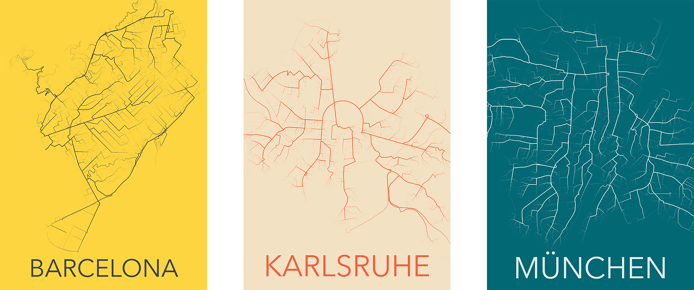
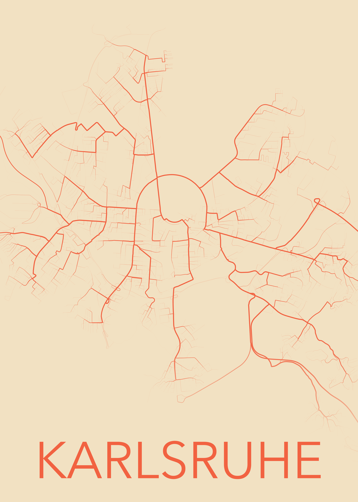

# Shortest Path Maps

Create beautiful maps from shortest path calculations in your city.

These maps are created by calculating the shortest paths from every point in the city to a specified point on the map. The wider a road, the more often it's used as the shortest püath to reach a point.

To test it yourself, follow `ShortestPaths.ipynb`. 

I recommend using Google Colab since computations may take a while.

## Examples

